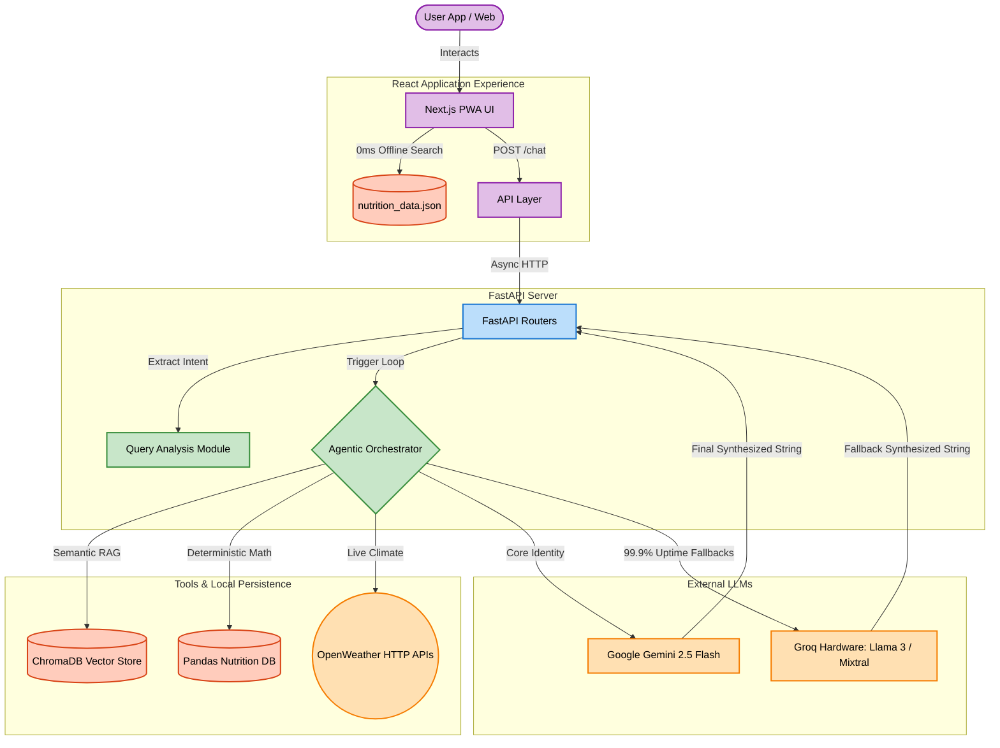

# 🥗 AI Diet Suggestion System (Indian Edition) - AAHAR

> **AAHAR** (Advanced Assistant for Healthy Alimentary Recommendations) is a highly sophisticated, context-aware AI agent designed to navigate the complex landscape of Indian dietary habits. It leverages an Agentic RAG pipeline to provide culturally relevant, nutritionally grounded, and environmentally aware food advice.


---

## 📸 Project Overview

**AAHAR** goes beyond standard LLM wrappers. It intelligently provides regionally-aware and dietary-type-specific Indian food suggestions using a RAG (Retrieval-Augmented Generation) pipeline, conversational memory, deterministic mathematical aggregations, and fallback LLM integrations via Groq.

It understands complex, layered queries like:
> *"Suggest a South Indian vegetarian dinner plan for diabetes."*
> *"What is the exact nutritional difference between Dal Makhani and Mixed Dal?"*
> *"Analyze my meal: 2 Rotis, 1 cup of Chana Masala, and a bowl of curd."*

---

## 🏗️ Architectural Workflow

AAHAR operates on a heavily decoupled architecture, utilizing a stateless asynchronous backend designed to scale alongside a 0ms-latency React PWA frontend.



---

## 🧠 Core Intelligence Features

### 1. Agentic Orchestration Loop (ReAct)
Unlike standard zero-shot chatbots, AAHAR uses a self-correcting **ReAct (Reason + Act)** agent loop. The orchestrator (Gemini 2.5 Flash) thinks about the query, selects the appropriate tool (Weather, RAG, Nutrition Fact, or Recipe), observes the output in a scratchpad, and iteratively refines its response before sending the final string to the user.

### 2. Zero-Latency Food Search (Client-Side Offloading)
Searching 10,000+ Indian dishes could overwhelm a server. AAHAR solves this by loading a static `nutrition_data.json` into the React application's memory. When users type in the search bar, the filtering math happens entirely inside their smartphone/browser, resulting in **0ms network latency**.

### 3. Integrated Meal Analyzer (Deterministic Math)
LLMs hallucinate numbers. AAHAR solves this by separating semantic reasoning from mathematics. 
The `/analyze-meal` engine provides professional-grade nutritional critiques:
*   **Numeric Aggregation:** A `Pandas` backend calculates exact totals for Calories, Protein, Carbs, Sugar, Fats, Fiber, and Sodium. 
*   **Fuzzy Searching:** Uses `FuzzyWuzzy` (Levenshtein Distance) to correct user typos automatically (e.g., mapping "Panner Tika" to the correct JSON data for "Paneer Tikka").
*   **AI Critique:** Finally, Gemini analyzes the exact mathematical totals to provide a professional assessment of the meal's balance and caloric density.

### 4. Zero-Auth Sticky Sessions
Users shouldn't need to create an account to get dietary advice. AAHAR uses a cryptographically secure, randomized Session Token generated on the frontend. This token maps chats and meal logs to a specific browser, functioning flawlessly over a completely **stateless** backend environment.

### 5. Hyper-Local Environmental Context
The system automatically makes REST API calls to **OpenWeather API**. The LLM uses this live environmental context to adapt its suggestions (e.g., suggesting cooling foods in May heatwaves, or warming foods during winter monsoons).

---

## 📂 Modular Codebase Architecture

The backend transitioned from a monolithic design to a highly scalable, isolated **FastAPI Router** pattern.

```text
Diet_Suggest_AAHAR/
├── aahar_react/            # 📱 Frontend: Next.js 16, React 19, Framer Motion
├── fastapi_app6.py         # 🚀 Backend: Main App Entrypoint & Uvicorn Boot
│
├── app/                    # 📦 Backend Core Logic
│   ├── api/                # 🌐 Web Endpoints (Routers for /chat, /analyze-meal)
│   ├── core/               # 🌍 Shared AppState (Memory for DB and LLM connections)
│   ├── ai/                 # 🧠 Intelligence Logic (Tools, Groq Fallback, Prompts)
│   ├── database/           # 🗄️ Data Management (Pandas, ChromaDB Extractors)
│   ├── query_analysis.py   # 🔍 NLP Regex mapping to detect goals/regions
│   └── models.py           # 📋 Pydantic Schemas enforcing strict JSON
```
*(For a deep-dive justification on why AAHAR uses Pandas over PostgreSQL, and LangChain over LlamaIndex, read the [details.md](./details.md) file).*

---

## 🌩️ Deployment & Usage

### 🔧 1. Clone & Install
```bash
git clone https://github.com/DYNOSuprovo/Diet_Suggest_AAHAR.git
cd Diet_Suggest_AAHAR

# Install Backend
pip install -r requirements.txt

# Install Frontend
cd aahar_react
npm install
```

### 🔑 2. Environment Configuration
Create a `.env` in the root backend directory:
```bash
GEMINI_API_KEY="your_key"
GROQ_API_KEY="your_key"
OPENWEATHER_API_KEY="your_key"
```

### 🥪 3. Running the Stack
```bash
# Start the FastAPI Backend
uvicorn fastapi_app6:app --host 0.0.0.0 --port 10000

# Open a new terminal and start the React Frontend
cd aahar_react
npm run dev
```

---

## 🚧 Cloud Deployment Note (Ephemeral Storage)
If deploying to a cloud container platform (like Render or Heroku), AAHAR natively handles ephemeral storage rollbacks. It actively manages the auto-download, unpacking, and cache-clearing of the large `db.zip` Chroma database from HuggingFace, ensuring crash-free reboots.

---

## 🙏 Acknowledgements
*   Created with ❤️ by **Suprovo** (Lord d'Artagnan).
*   [LangChain](https://github.com/langchain-ai/langchain) for the orchestration framework.
*   [Google AI](https://ai.google.dev/) for the Gemini 2.5 Flash capabilities.
*   [Groq API](https://console.groq.com/) for ultra-fast fallback inference.

## 📜 License
MIT License — Fork it, improve it, contribute!
